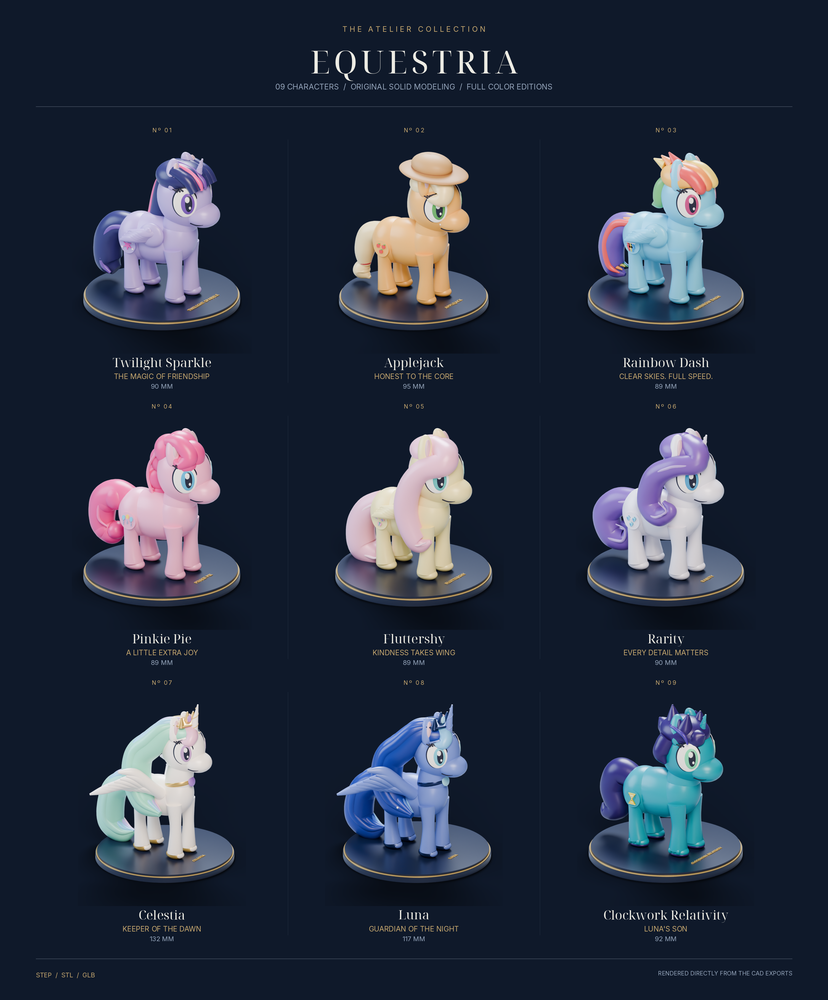
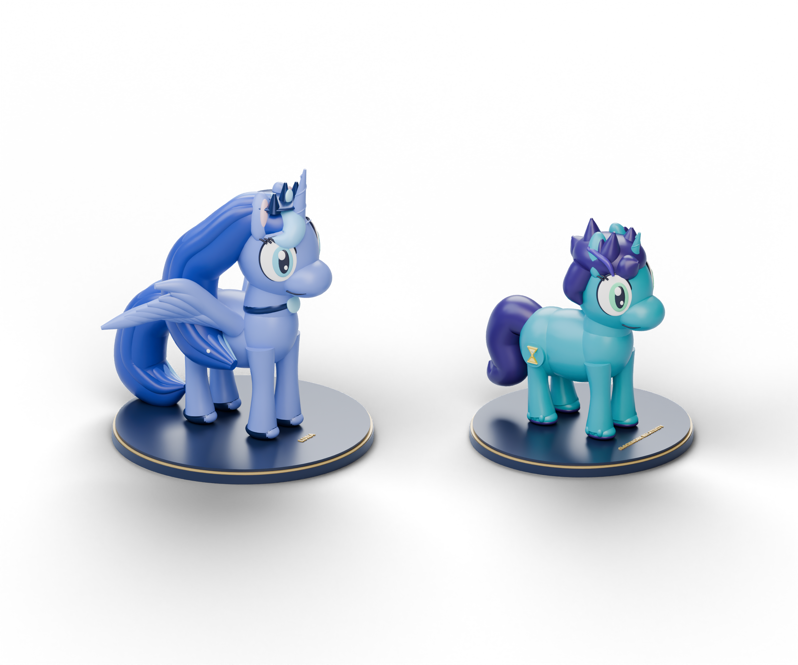
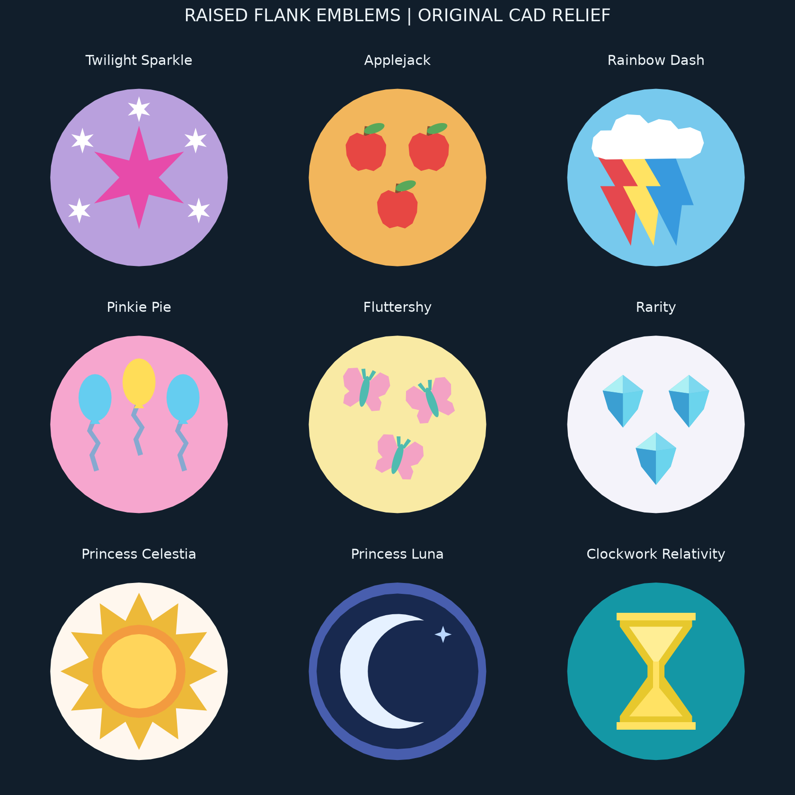
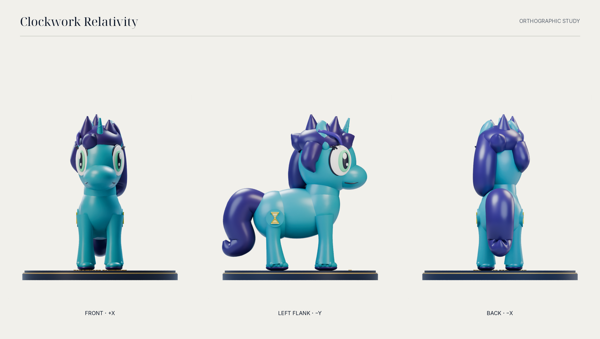
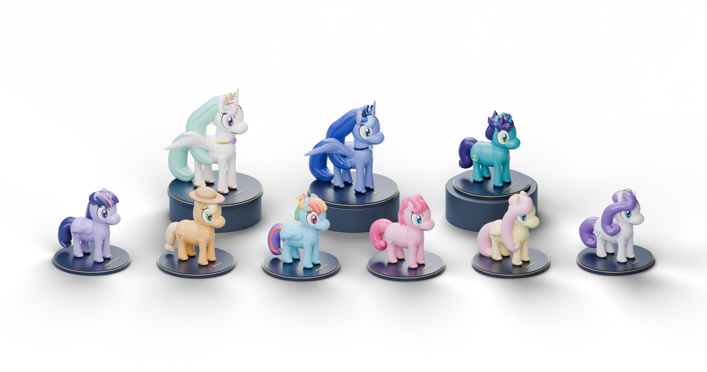

# Nine ponies, one CAD pipeline

*The making of Equestria · Atelier Collection, an LLM-assisted modeling experiment with Codex.*

This project began with a request for an "ultimate" CAD collection of the Mane Six, Princess Celestia, and Princess Luna. It became nine original sculptures when the user added Clockwork Relativity, their original character and Luna's son. The finished collection contains 835 named CAD components, nine editable STEP assemblies, nine joined STL meshes, nine colored GLB scenes, and a Blender scene containing the full cast.

The interesting part was getting all of those outputs to agree. A convincing portrait could hide a detached smile. A valid mesh in memory could become invalid when saved. A color value could survive export numerically and still look wrong because the next format interpreted it differently. The work involved repeated changes to the models, export code, and checks until the saved files passed the collection's verification requirements.



This report reconstructs the design decisions and technical corrections from the project source, its recorded build history, and the delivered validation reports. It identifies the work as LLM-assisted: the user supplied the brief, character direction, and Clockwork reference; Codex authored and iterated the modeling code, export tools, presentation, and documentation.

## Turning the brief into an editable collection

The starting cast was Twilight Sparkle, Applejack, Rainbow Dash, Pinkie Pie, Fluttershy, Rarity, Celestia, and Luna. Twilight was modeled as an alicorn. The collection needed a consistent sculptural style while retaining each character's silhouette, hair, colors, and cutie marks.

Every figure received a layered circular plinth, raised name lettering, rounded anatomy, layered eyes, and raised cutie marks on both flanks. The royal sisters received longer proportions, larger plinths, spread wings, and regalia. Their scale differences are part of the source definition: Celestia is approximately 132.30 mm tall and Luna 116.72 mm tall, including their bases. The other seven figures are approximately 88.73–94.85 mm tall.

Clockwork arrived through a supplied pixel-art reference. The user confirmed his unicorn form and hourglass mark, which define the final model. The design carries the reference's teal coat (`#1497A5`), deep purple hair (`#342064`), green eyes, purple hoof accents, and yellow-gold hourglass. His mane uses a tousled silhouette and cheek-length locks. A separate portrait of Luna with Clockwork gives the addition a place in the collection's presentation.



The character definitions live in [source/design.py](source/design.py). The generated [outputs/collection.json](outputs/collection.json) records every component's name, primitive type, color, and geometry parameters. This made changes reviewable at the level of a particular mane lock or flank symbol.

## Constructing organic shapes with CAD solids

The geometry was authored in Python using CadQuery and OpenCascade. A small vocabulary of solids was sufficient for the collection:

| Primitive | Use in the figures |
|---|---|
| Ellipsoid | Body masses, heads, muzzles, eyes, hooves, curls, and gems |
| Lofted tube | Manes, tails, feathers, eyelashes, facial lines, and horn spirals |
| Cone | Horns, crown points, and tapered tufts, with positive tip radii |
| Cylinder | The layers of each display plinth |
| Extruded polygon | Raised cutie marks and their connecting plaques |
| Extruded text | The name on each plinth |

The tubes use sampled paths and changing radii, with circular sections lofted into closed solids. This gives a mane an editable path and thickness rather than a fixed set of hand-moved mesh vertices. The [geometry contract](docs/geometry-contract.md) specifies the supported fields, coordinate system, and export requirements.

A shared body construction gave the cast consistent proportions, but the hair and accessories were authored by character:

| Character | Features carried by the model |
|---|---|
| Twilight Sparkle | Horn and wings, structured fringe, pink mane stripes, and a star emblem |
| Applejack | Hat, freckles, tied hair, and three apples |
| Rainbow Dash | Swept multicolor hair, wings, and a cloud with a lightning bolt |
| Pinkie Pie | Rounded curls, spiral hair details, and balloons |
| Fluttershy | Long draped hair, wings, and butterflies |
| Rarity | Sculpted curling hair, horn, and diamonds |
| Princess Celestia | Taller royal proportions, multicolor flowing locks, spread wings, regalia, and a sun |
| Princess Luna | Royal proportions, blue flowing locks with stars, spread wings, regalia, and a moon |
| Clockwork Relativity | Teal coat, violet tousled hair, horn, purple hoof accents, and a gold hourglass |

The cutie marks are original polygon drawings in [source/emblems.py](source/emblems.py). Their relief sits on a body-colored plaque that overlaps the figure. Each side has its own outward extrusion direction. That detail matters: mirroring the picture alone would not ensure that the geometry projects outward on the opposite flank.

The mark contact sheet comes from those same profiles. It is useful for reviewing the drawings before they are placed on curved anatomy.



## Correcting the design in three dimensions

Small facial details caused some of the earliest connectivity problems. Smiles and Applejack's freckles could look attached from the camera while remaining separate solids in space. Moving them farther into the head gave them actual overlap with the underlying geometry.

The cutie marks needed the opposite positional correction. Their relief was initially too far inside the flank to read clearly. Moving the marks outward exposed the symbols while retaining their connection through the plaque. Visual inspection and connectivity checks were both needed: the correct amount of overlap had to leave the drawing visible.

Twilight's stripes and the royal sisters' colored hair locks also needed to reach the visible surface of the larger mane shapes. Their presence in the component list did not establish that a viewer could see them. The paths and offsets were adjusted, then rendered again.

Two tiny enclosed seam cavities in Twilight's geometry were filled during refinement. The horn spiral also needed care near its narrow tip; tightly wound geometry at that point created an avoidable construction problem. The final construction keeps the tip blunt and avoids carrying a tight spiral into it.

These revisions are a practical consequence of using intersecting solids for organic sculpture. A narrow gap, a buried color accent, and a detached decorative piece can each be almost invisible from a favorable angle. The front, side, and back views provide additional views of the result, while the union checks reveal connectivity that an image cannot establish.



## Establishing a working local toolchain

The initial Python 3.12 environment could not use the selected `bpy` wheel combination. The project moved into an isolated Python 3.11 environment so the CAD tools and Blender's Python module could run together. The delivered build records Python 3.11.16, CadQuery 2.8.0, cadquery-ocp 7.9.3.1.1, trimesh 5.1.0, manifold3d 3.5.3, and Blender's `bpy` 4.4.0. The dependency list is in [requirements.txt](requirements.txt).

Font handling exposed another environment issue. Asking the CAD text builder for an unavailable default font caused a native crash. The fix was to pass an explicit font path and bundle Noto Sans Bold with its matching SIL Open Font License. The name lettering is geometry, so a font substitution can change the model as well as its appearance. The launcher selects the bundled font; direct exporter runs can set `CAD_FONT_PATH`.

The local launcher, [build.sh](build.sh), keeps installation separate from rebuilding. Dependencies live under the project directory, and opening the launcher without a command does not start an installation.

## Keeping the export formats connected to the source

The normal build path is:

```text
Python character definitions and emblem drawings
                    ↓
         Named component parameters in JSON
                    ↓
           CadQuery / OpenCascade solids
                    ↓
          ┌─────────┴──────────────┐
          ↓                        ↓
   STEP assemblies          CAD tessellation
                                   ↓
                         ┌─────────┴────────┐
                         ↓                  ↓
                    Colored GLB      Boolean union → STL
                         ↓
                  Blender renders and scene
                         ↓
                   Catalog and study sheets
```

STEP preserves named, colored design components with intentional overlaps. Its editable assembly contains the resulting solids; the Python and JSON provide the construction definition. A native feature-history tree for a particular CAD application is outside the export. Some named components, such as text, can contain multiple solids; the component count and the solid count therefore measure different things.

GLB preserves the named tessellated components and their colors. The STL is the boolean union of the component meshes. That union removes their internal overlaps. Component volumes in the STEP report double-count overlapping regions; the STL report records the joined object's volume.

Units and axes are explicit. CAD and STL coordinates are millimeters, with Z up. GLB coordinates are meters, with Y up. The renderer imports the GLB and handles the conversion into Blender. STL has no unit declaration, so a slicer must interpret its coordinates as millimeters.

### Meshing settings needed an explicit correction

CadQuery's default meshing behavior uses relative deflection. The intended contract was an absolute linear setting of 0.10 mm, paired with an angular setting of 0.12 radians. The exporter was changed to call OpenCascade's mesher explicitly in absolute mode and extract that mesh directly. Calling a convenience tessellation method afterward could reintroduce the relative behavior.

A regression test uses a large sphere to distinguish the two behaviors. These values configure tessellation. A parameter alone cannot certify a maximum error at every point, and manufacturing accuracy requires separate measurements. The documentation preserves these limits because file precision and physical print accuracy measure different things.

### Color values needed the correct interpretation

The palette is authored as hex sRGB values. glTF material color factors require linear values. Writing the hex channel values directly into those factors produced the wrong interpretation of the palette.

The exporter now converts sRGB into linear factors and writes them into the GLB material data with enough precision to avoid an extra eight-bit quantization step. An acceptance test checks a known channel conversion in the exported GLB. Lighting and view transforms still affect the rendered appearance, but the material input is now defined consistently.

## The STL problems were about topology and serialization

The most consequential export correction came after a successful boolean union. manifold3d supplied an indexed mesh with closed, consistently oriented topology. Applying generic trimesh validation to that result removed tiny but valid intersection triangles and opened the surface.

The exporter therefore preserves the union's vertex indices and faces without post-union simplification. It checks the result instead of assuming that a generic cleanup step will improve it. This preservation applies to the union stage; the source code separately validates the meshes derived from individual CAD components.

A second problem appeared during serialization. Binary STL stores coordinates as float32. Rounding nearby coordinates could merge distinct vertices and damage a mesh that had passed in memory. The delivered STL files use ASCII decimal coordinates that preserve the resulting union's float64 values. They are then imported again and checked.

That choice makes the files larger. It also preserves information that binary serialization was discarding in this collection. ASCII storage does not make the original design more accurate, and it cannot recover precision already lost earlier in the pipeline.

### Regeneration retained source provenance

The final reports record STL regeneration where it was needed. One route recovered the named CAD tessellations from the matching GLB, converted the positions back into millimeters, and checked component bounds against the original tessellation report within 0.001 mm. Those GLB positions began as float32, even though the subsequent union and ASCII output used float64.

Applejack and Celestia used fresh tessellation of the original STEP solids. That route checked the imported solid count and assembly bounds before generating a new float64 tessellation at the documented absolute settings. Each character's `stl_repair` entry records the source choice, relevant source hashes, and regeneration details.

Clockwork required one final, narrowly defined normalization. Standard STL loading welded nearby vertices and left two faces whose vertex indices repeated. Only those two already-collapsed faces were removed. His report records zero change in volume and unchanged bounds. No triangle-area threshold was used, so small triangles with three distinct indices were retained. A dedicated acceptance test covers that behavior.

The final acceptance condition applied to the saved STL: watertight geometry, consistent winding, positive volume, and exactly one connected shell. A failure at that point stopped the export from being reported as successful.

## Rendering the exported geometry

The studio renderer reads the actual colored GLB exports. It does not substitute a separate illustration mesh for the figures. Smooth shading is applied to the CAD tessellation for presentation; this changes how surfaces are shaded without replacing their geometry.

The presentation includes nine 1200 × 1400 portraits, 27 orthographic views at 900 × 1000, and nine 3000 × 1700 study sheets. The full-cast image is 3600 × 1900, the Luna-and-Clockwork image is 2400 × 2000, and the 3 × 3 catalog is 3000 × 3620. Additional presentation plates compose these renders with labels and layout.



Render reports record image hashes, resolution, renderer information, and the hashes of the source GLBs. Catalog reports record their source images and output hashes. This lets the collection checker catch a polished image that belongs to an older model.

The full-cast Blender file was saved and opened again programmatically. Its [readback report](outputs/reports/blend.json) confirms nine characters and identifies their source GLBs. This is evidence for the delivered scene file; it does not claim that every target application's interactive interface was tested.

## What the final checks established

The separate collection checker reloads the delivered files and compares them with the current design and reports. The [final verification report](outputs/reports/verification.json) records nine passing character checks, zero failures, and full presentation verification enabled.

| Check | Evidence required |
|---|---|
| Current design | Python character definitions agree with the JSON and its recorded design hashes |
| CAD solids | Valid, positive-volume solids; saved STEP imports with the expected solid count |
| Component export | GLB retains the expected names and agrees with the STL's transformed bounds |
| Joined mesh | Saved STL is watertight, consistently wound, positive-volume, and one connected shell |
| Scale and placement | Saved STL dimensions agree with the report; geometry does not extend below the build plate beyond the check's allowance |
| File identity | STEP, STL, and GLB hashes agree with the export reports |
| Images | Expected views exist, image dimensions and hashes match, and source GLB hashes are current |
| Blender and catalog | Saved scene and presentation assets agree with their source records |

The acceptance suite passed all ten tests. Seven exercise the exporter: all six primitive types, format round trips and axis conversion, disconnected-component rejection, preservation of a near-coplanar union, absolute tessellation settings, STL coordinate precision, and the collapsed-index normalization. Three exercise the cutie marks: outward profiles on both flanks, overlap with the joining plaque, and rejection of invalid requests. The tests are in [source/test_export_cad.py](source/test_export_cad.py) and [source/test_emblems.py](source/test_emblems.py).

The delivered STL triangle counts total **2,455,018**. Heights below include the plinth and are rounded to two decimal places; the individual reports retain more detail.

| Character | Named CAD components | STL triangles | Height, mm |
|---|---:|---:|---:|
| Twilight Sparkle | 95 | 271,490 | 90.13 |
| Applejack | 84 | 191,508 | 94.85 |
| Rainbow Dash | 88 | 271,384 | 89.32 |
| Pinkie Pie | 81 | 215,752 | 89.28 |
| Fluttershy | 100 | 218,832 | 88.73 |
| Rarity | 84 | 269,204 | 90.13 |
| Princess Celestia | 107 | 369,774 | 132.30 |
| Princess Luna | 111 | 377,492 | 116.72 |
| Clockwork Relativity | 85 | 269,582 | 92.05 |
| **Total** | **835** | **2,455,018** | Varies |

The packaged model archives were also read back and verified using their ZIP CRCs and SHA-256 hashes. The recorded complete model package is approximately 321.1 MiB; the STEP package is 5.2 MiB and the STL package 125.7 MiB. Publication materials may be distributed alongside these model packages. Archive filenames and their exact sizes belong to the release's download listing and checksum manifest.

## Rebuilding and changing a figure

The delivered STEP, STL, GLB, and Blender files can be opened without installing the generation environment. To rebuild the collection from source with `uv` available:

```bash
./build.sh install
./build.sh all
./build.sh test
```

`all` rebuilds the models, renders the collection, and runs collection verification. CPU rendering can take substantial time. To iterate on one character:

```bash
./build.sh models clockwork_relativity
.venv311/bin/python source/render_studio.py --only clockwork_relativity --quick
```

Edit the character definitions in `source/design.py`, or edit the flank drawings in `source/emblems.py`. Rebuild the affected GLB before rendering it. A quick preview helps inspect a change; full-resolution renders and the final verification step should follow before replacing a release asset.

The standard design generator overwrites `outputs/collection.json`. Make a separate copy when experimenting directly with JSON, and use a separate output directory for that export. Save manually edited Blender scenes under another filename before regenerating the cast scene. The [printing and editing guide](docs/printing-and-editing.md) covers these workflows and the format conventions in more detail.

## The boundary of the experiment

All sculpture geometry was authored for this project using Python solids and original polygon drawings. No downloaded character meshes or extracted game assets were used. The eight established characters are fan-art interpretations of *My Little Pony: Friendship Is Magic*. Clockwork Relativity is the user's original character, modeled from their supplied reference. The bundled font retains its own attribution and license.

The build and programmatic imports were exercised on Linux. Native CAD application behavior and source rebuilding on macOS or Windows were not tested. The collection has not been physically printed. No printer settings, support strategy, material strength, or support-free fabrication claim follows from the mesh checks.

These are decorative solid figures with fine details and overhangs. They have no designed hollow interiors, drainage holes, keyed joints, or manufacturing clearances. Anyone preparing a print should inspect the slicer's layer preview at the chosen scale, particularly around eyelashes, feathers, lettering, horns, and flank relief.

A useful next iteration would begin with a physical print at a recorded scale, followed by inspection of the fine relief and narrow connections. That would add fabrication evidence to the digital checks already recorded here.
